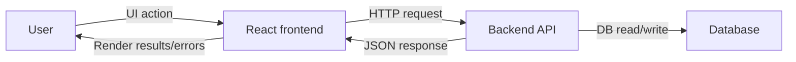

# Architecture

## Purpose
This document defines the architecture of your application at a level suitable for an AI coding assistant. It exists to:
1. Explain the high-level system responsibilities and data flow.
2. Provide rules for how the assistant should propose changes that are safe, testable, and consistent.
3. Standardize how AI-generated work should document tradeoffs and decisions.

Keep this file generic so it can be reused across projects with different business domains (for example, a bookstore instead of a water-tracking app).

## Scope
In-scope:
- Frontend responsibilities (UI, state management, routing, API client usage).
- Backend API responsibilities (controllers/endpoints, validation, persistence, authentication/authorization if applicable).
- Persistence responsibilities (database, migrations, schema evolution).
- Cross-cutting concerns (error handling, logging, CORS, configuration).
- AI assistant behavior rules for architecture changes.

Out-of-scope:
- Domain-specific business logic details (book vs. project; inventory vs. water consumption). Those belong in code and in domain-focused docs.

## System Overview
### Frontend (React)
The frontend typically:
- Uses client-side routing to navigate between pages (for example: catalog, book details, cart, checkout).
- Manages UI state and derived state (for example: cart items, selected filters).
- Calls backend API endpoints via a small API layer (direct fetch/axios or a dedicated client module).
- Provides user feedback for loading, empty states, and errors.

### Backend API (.NET)
The backend typically:
- Exposes REST endpoints under controller routes (for example: catalog endpoints, cart endpoints, order endpoints).
- Validates inputs (query params, body models) and returns consistent error responses.
- Uses persistence (database) through a data-access layer (for example: Entity Framework DbContext).
- Applies cross-cutting middleware (CORS, HTTPS redirection, authorization, OpenAPI).

### Persistence
The persistence layer typically:
- Stores business entities and their relationships (for example: books, authors, carts, orders).
- Supports pagination/filtering where the UI requires it.
- Evolves safely via migrations and versioned schema changes.

## Data Flow (Request/Response)
1. User interacts with a React page (page components).
2. UI state updates (local state or shared state via context/store).
3. Frontend triggers an API call (API client module).
4. Backend receives the request in a controller action.
5. Backend validates and maps request data to domain/persistence models.
6. Persistence reads/writes data in the database.
7. Backend returns a JSON response (success or standardized error payload).
8. Frontend updates UI state and renders results or error messaging.

## Error Handling Expectations
AI-generated changes must preserve or improve error handling consistency:
- Frontend:
  - Distinguish network errors vs. API validation errors.
  - Display actionable messages where appropriate.
- Backend:
  - Return clear HTTP status codes (400 for client validation errors, 401/403 for auth, 404 for not found, 500 for unexpected failures).
  - Keep error response shape consistent across endpoints.

## Performance and Pagination
When implementing list endpoints:
- Use pagination parameters (for example: `pageNum`, `pageSize`).
- Avoid returning unbounded collections unless the UI requires it.
- Ensure database queries apply filters before pagination (`Skip/Take` after `Where`).

## Security and Safety Constraints
AI-generated changes should include:
- Input validation on the backend for any user-controlled fields.
- Safe CORS configuration (avoid AllowAnyOrigin if credentials/auth are involved).
- Avoid logging sensitive data (tokens, passwords, payment info).

If the project introduces authentication/authorization:
- Ensure authorization checks exist at the backend boundary (controllers/policies), not only in the UI.

## AI Behavior Rules (Architecture Work)
When asked to implement architecture or systemic changes, the assistant must:
1. Identify the affected layers (frontend page/state, API client, backend controller, persistence).
2. Propose a small, incremental change path when possible.
3. Explicitly list:
   - assumptions (what you believe about the current codebase),
   - risks (what could break),
   - verification steps (how you will confirm it works).
4. Keep domain terminology consistent (use bookstore terms in examples, but keep the structure generic).
5. Prefer changes that are easy to test and revert.

### Architecture Change Template
For architecture proposals, the assistant should respond with:
- Problem statement (1-2 sentences).
- Proposed shape of change (what files/layers will be touched).
- Data flow impact (what request/response changes).
- Verification plan (build/run steps and what endpoints/pages to test).
- Decision rationale (why this approach over alternatives).

## Example Diagram (Optional)

